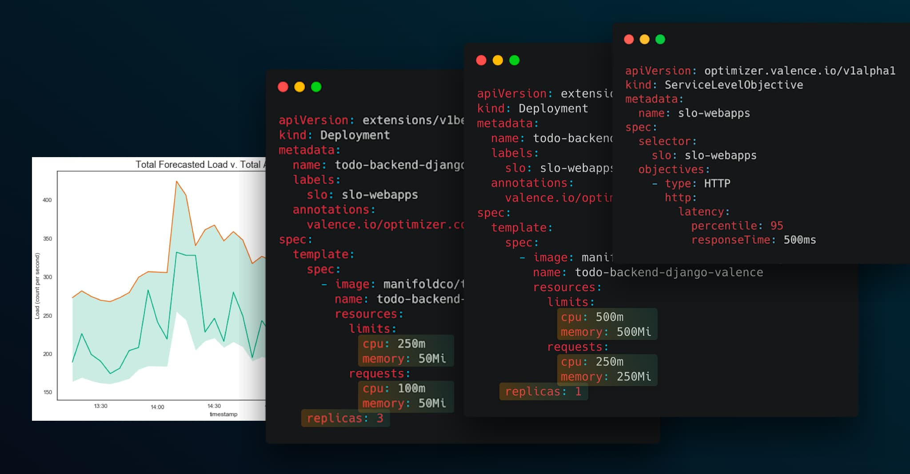

# Valence 🚀🤖



## Introduction
Valence is an autoscaler operator for Kubernetes for right sizing and autoscaling containers intelligently to meet performance objectives. It learns how applications behave and optimizes resources according to defined Service Level Objectives manifests. Valence manages bidirectional pod autoscaling in order to ensure maximum utility of your cluster without performance degredation. Valence is **not a replacement of Vertical Pod or Horizontal Pod Autoscalers but an operator that reconciles the two** and will autoconfigure them based on application behaviour.

## How it works
Valence is based on the notion of Declarative Performance. We believe you should be able to declare performance objectives and have an operator (Valence) which figures out how to autoscale, right size, and pack your Kubernetes resources. In contrast, current Kubernetes scaling and performance management tools are largely imperative requiring overhead to determine right size, autoscaling metrics, related configuration. Since code, traffic, and node utilization changes - we believe this should be managed automatically by an operator, rather than by manual calculation and intervention. We also think the right unit of scaling isn't utilization or metrics thresholds but based, dynamically, on how applications behavour (utilization) responds to its use (such as HTTP Requests).

## Declarative Performance: The Service Level Objective Manifest

Like Kubernetes goes and figures out how to get a Deployment running with replica sets and pods and has a controller figuring out how to maintain the declared state of the Deployment, Valence goes and figures out how to maintain, and continue to maintain, the declared performance with ServiceLevelObjective manifests.

Use these [ServiceLevelObjective](./example/workloads/slo-webapps.yaml) objects to manage your applications performance, right sizing, and autoscaling instead of setting all that up manually. This is the main interface for Operators to use Valence.

**What if I don't have SLOs for my application!!**
Most people don't have formal SLOs ([read more here](https://landing.google.com/sre/sre-book/chapters/service-level-objectives/)) that they have built tooling around for monitoring let alone management by them. We see this as a chance to start using them. They are a great abstraction for declaring the core performance requirements of your application which you will have even if you don't have formal SLOs.

```
apiVersion: optimizer.valence.io/v1alpha1
kind: ServiceLevelObjective
metadata:
  name: slo-webapps
spec:
  # First we define a selector. 
  # We use this to label deployments to tell Valence to meet the following objectives for those [deployments.](https://github.com/valencenet/valence-manifests/blob/master/example/workloads/todo-backend-django-valence/deployment.yaml#L7)
  selector:
    slo: slo-webapps
  
  # Now we declare our objectives. So far we only have HTTP objectives. We are working on a bunch more, let us know if you have ideas.
  objectives:
    # The http objective consists of ideal latency for a percentile at a throughput.
    # Omit throughput if you want to maintain that latency no matter the throughput (ie. autoscaling v. rightsizing)
    - type: HTTP
      http:
        latency:
          # Valid values are 99, 95, 90, 75, 50.
          percentile: 99
          # The ideal response time for that percentile.
          responseTime: 100ms
        # This is throughput of queries per minute.
        # Omit this for autoscaling (ie. latency objective valid for all throughputs).
        throughput: 500
```


## TOC
1) [How to get started](#how-to-get-started)
2) [Installation](#installation)
3) [Using Valence](#using-valence)
4) [Testing Valence with Example Workloads](#example-workloads)

**See example deployment set up in example/workloads**

## Want to get started quickly with example workloads?
- start on a fresh cluster such as docker-for-desktop
- if your cluster already has metrics-server remove `./metrics-server` from `./example/tooling/kustomization.yaml` and recompile `make example-workloads`
- `kubectl apply -f valence.yaml`
- `kubectl apply -f example-workloads.yaml`
- `kubectl proxy svc/grafana -n valence-system &`
- `open http://localhost:8001/api/v1/namespaces/valence-system/services/grafana/proxy`
- Authentication is Grafana Default: username: admin, password: admin
- Recommendations for Replicas, Requests and Limits, and live changes to those should start coming in 5-20 minutes.

## How to get started
In order to get the most of out Valence, we recommend starting with Valence in recommendation mode. This will help you understand the configuration options of Valence, before going into Live mode where Valence takes control of your deployments resourcing and scaling on your behalf.
**Note: Valence is currently limited to managing 5 deployments without a license key. If you'd like a beta license key contact dom@valence.net**

**Step 1 - Installation:**
Follow the installation instructions below (full support from the Valence team will be available @ dom@valence.net)

**Step 2 - Recommendation Mode:**
Pick a few deployments you’d like to see recommendations being made on and write SLO manifests for them.
We recommend you observe Valence recommendations for a couple days at this point. Please discuss any concerns you may have or feedback with the Valence team as you are observing recommendations. During this period you should manually use those recommendations as you please.
**Note: our prometheus only retains data for 6 hours so you will have to make your observations accordingly**

**Step 3 - Live Mode, limited deployments:**
Now we recommend you let Valence take full control of those deployments by [using Valence Annotations](#using-valence-annotations). Again take a couple days to observe how Valence is operating those deployments and direct any feedback to the Valence team.

**Step 4 - Full roll out:**
Add more deployments for recommendations or management by Valence.

## Installation

Installing Valence:
1. [Installing Valence Operator](#installing-valence-operator)
2. [Preparing Deployments and Services for Operation by Valence](#preparing-deployments-and-services-for-operation-by-valence)
3. [Setting SLOs](#setting-slos)

### Installing Valence Operator

Valence is an operator that lives in its own namespace with all the tools it needs.


You will need to have the following components installed to use Valence.
If you don't have these, you can take a look at the tooling manifests for examples.

**Prerequests:**
- [metrics-server](https://github.com/kubernetes-incubator/metrics-server)
- Scrapable [kube-state-metrics](https://github.com/kubernetes/kube-state-metrics) with the following serivce label: `app: kube-state-metrics` **Note:** This component is only necessary for supplementing our dashboard if you don't need existing deploy information in the dashboard than its optional.
- Ensure the following metrics from kube-state-metrics are available: kube_pod_container_resource_requests_memory_byte, kube_pod_container_resource_limits_memory_bytes, kube_pod_container_resource_requests_cpu_cores,
kube_pod_container_resource_limits_cpu_cores,
kube_deployment_status_replicas_available


Valence can be installed by applying the valence.yaml you will find in the valence repo.
```
kubectl apply -f valence.yaml
```
Valence can be removed by deleting valence.yaml
```
kubectl delete -f valence.yaml
```

Components installed in valence-system namespace:
- Prometheus (Valence’s own managed Prometheus)
- Grafana with Valence Dashboards (Valence’s own managed Grafana)
- Valence Operator

If you need to **modify** these files you can use the make commands to recompile the manifests. (ie. `make valence` (you will need Kustomize `make install-kustomize` to install))

### Preparing Deployments and Services for Operation by Valence
There are five steps to operating a deployment with Valence.

**1) Write a SLO for a deployment or group of deployments**

Example: [slo-webapps.yaml](./example/workloads/slo-webapps.yaml)
```
apiVersion: optimizer.valence.io/v1alpha1
kind: ServiceLevelObjective
metadata:
  name: slo-webapps
spec:
  # First we define a selector. 
  # We use this to label deployments to tell Valence to meet the following objectives for those [deployments.](https://github.com/valencenet/valence-manifests/blob/master/example/workloads/todo-backend-django-valence/deployment.yaml#L7)
  selector:
    slo: slo-webapps
  objectives:
    - type: HTTP
      http:
        latency:
          # Valid values are 99, 95, 90, 75, 50.
          percentile: 99
          responseTime: 100ms
        # Omit this for autoscaling (ie. latency objective valid for all throughputs).
        # This is throughput of queries per minute.
        throughput: 500
```

**2) Label the deployment with that SLO and add Prometheus Proxy:**

Valence collects application metrics through a sidecar. If you’d prefer to collect metrics based on your ingress, load-balancer, envoy containers or otherwise, let the Valence team know. This will eventually be automated,  all feedback is appreciated!

Add the proxy container to your deployment and set the target address to where your application is normally serving.

Example: [todo-backend-django/deployment.yaml](./example/workloads/todo-backend-django-valence/deployment.yaml)
```
apiVersion: extensions/v1beta1
kind: Deployment
metadata:
  name: todo-backend-django
  labels:
    app: todo-backend-django
    slo: slo-webapps
...
  template:
    metadata:
      labels:
        app: todo-backend-django
        slo: slo-webapps
...
    spec:
      containers:
      - name: prometheus-proxy
        image: valencenet/prometheus-proxy:0.2.3
        imagePullPolicy: IfNotPresent
        env:
        - name: TARGET_ADDRESS
          value: "http://127.0.0.1:8000" # where your app is serving on
        args:
          - start
...
```

**Note: Valence will make relatively frequent changes so we recommend you ensure at least the following availability configuration for your deployments:**

```
spec:
  # Revision history limit should be low but # greater than 1.
  revisionHistoryLimit: 3
  strategy:
    # Ensure we use rolling updates with:
    rollingUpdate:
      maxSurge: 1
      maxUnavailable: 0
```
It is also helpful if you are using readiness and liveness probes to ensure availablity.

**3) Label your Kubernetes Service for that Deployment with the Valence proxy collection and replace your existing service with a Valence comptable service.**

Example [todo-backend-django/service.yaml](/Users/domenicrosati/manifold/valence-manifests/example/workloads/todo-backend-django-valence/service.yaml)
Change:
```
apiVersion: v1
kind: Service
metadata:
  labels:
    service: todo-backend-django
  name: todo-backend-django
spec:
  # Works with any service type, NodePort just an example.
  type: NodePort
  ports:
  - name: headless # example port name
    port: 80
    targetPort: 8080
  selector:
    app: todo-backend-django
```
To:
```
apiVersion: v1
kind: Service
metadata:
  name: todo-backend-django
  labels:
    service: todo-backend-django
    # Scrape prometheus metrics by valence.
    valence.net/prometheus: "true"
spec:
  type: NodePort
  ports:
  # This would be your port you were exposing your application on.
  - name: headless # this name is arbitrary and can be changed to anything you want.
    port: 80
    targetPort: 8081 # this is the port prometheus-proxy is serving on
  # These three lines allow us to scrape application metrics.
  - name: prometheus
    port: 8181
    targetPort: 8181
  selector:
    app: todo-backend-django
```
## Using Valence

Using Valence:
1. [Using Valence Annotations](#using-valence-annotations)
2. [Viewing Valence Recommendations and Changes](#viewing-valence-recommendations-and-changes)

### Setting SLOs
Setting a SLO is done via writing the manifest, applying it, and registering a deployment using the label defined in the slo selector.

Example:
```
apiVersion: optimizer.valence.io/v1alpha1
kind: ServiceLevelObjective
metadata:
  name: slo-webapps
spec:
  selector:
   # The label you want to select on deployments.
    slo: slo-webapps
  objectives:
    - type: HTTP
      http:
        latency:
          # Percentile you'd like your response times to fall under.
          # Valid values are 99, 95, 90, 75, 50.
          percentile: 99
          # Response time you want your application to meet.
          responseTime: 100ms
        # The throughput objective you want the latency objective to be valid for.
        # Omit this for throughput scaling (ie. latency objective valid for all throughputs).
        # This is throughput of queries per minute.
        throughput: 500
```

## Using Valence Annotations
You can use these optional [annotations](https://github.com/valencenet/valence-manifests/blob/master/example/workloads/todo-backend-django-valence/deployment.yaml#L8) on the deployments managed by Valence:
```
  annotations:
    # Whether to make changes automatically with recommendations.
    valence.io/optimizer.configure: "true"
    # Minimum amount of replicas to recommend.
    valence.io/optimizer.min-replicas: "2"
    # Minimum cpu requests to recommend.
    valence.io/optimizer.min-cpu-requests: "100m"
    # Minimum memory requests to recommend.
    # Set this to your max heap size if you are using JVM.
    valence.io/optimizer.min-memory-requests: "500M"
```

## Viewing Valence Recommendations and Changes

### Recommendations

The recommendations are available in [prometheus exposition format](https://prometheus.io/docs/instrumenting/exposition_formats/#text-based-format). Valence exposes its metrics on `/metrics` endpoint on port 8181 of the `optimization-operator.valence-system` service and can be scraped by prometheus and other similar tools for metrics collection in a standard way. 

We expose the following metrics:
- valence_recommendations_cpu_limits
- valence_recommendations_cpu_requests
- valence_recommendations_memory_limits
- valence_recommendations_memory_requests
- valence_recommendations_replicas

For a example of how we scrape these recommendations for our own local prometheus see [config-map](manifests/valence/prometheus/config-map.yaml#L255) . Here we scrape on the following label: `app.kubernetes.io/component: operator`


### Grafana

Open Grafana
```
kubectl proxy svc/grafana -n valence-system
open http://localhost:8001/api/v1/namespaces/valence-system/services/grafana/proxy
```
Authentication is Grafana Default:
- username: admin
- password: admin

Once you are in Grafana look at the Valence Recommendations dashboard.
You will see:
- Memory recommendations and resources
- CPU recommendations and resources
- HTTP Request Count in Queries per Second
- HTTP Latency at selected percentile
- Replica recommendations and current replicas

## Example Workloads

If you want to test out valence on example workloads we have provided examples manifests that you can use. We generate synthetic workloads using our realistic workload generation tool Majin (see the workload.yaml files). See the `example/workloads` dir for more details.

The workloads for testing are:
- todo-backend-django (this is a control workload not using valence)
- todo-backend-django-valence

They will use the following SLO manifests:
- slo-webapps

Want to get started quickly with example workloads?
- start on a fresh cluster such as docker-for-desktop
- if your cluster already has metrics-server remove `./metrics-server` from `./example/tooling/kustomization.yaml` and recompile `make example-workloads`
- `kubectl apply -f valence.yaml -f example-workloads.yaml`
- `kubectl proxy svc/grafana -n valence-system &`
- `open http://localhost:8001/api/v1/namespaces/valence-system/services/grafana/proxy`
- Authentication is Grafana Default: username: admin, password: admin
- Recommendations for Replicas, Requests and Limits, and live changes to those should start coming in 5-20 minutes.
